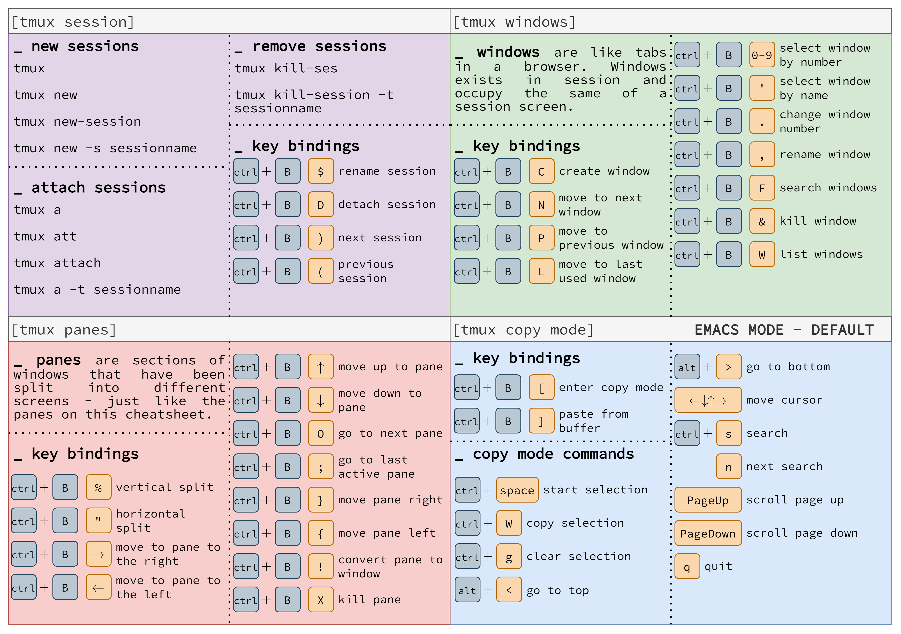
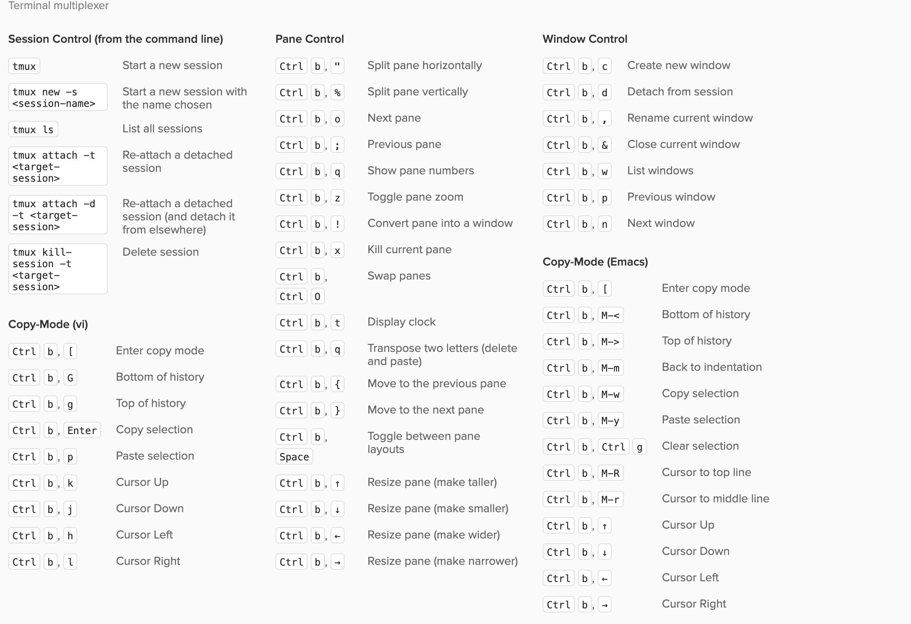
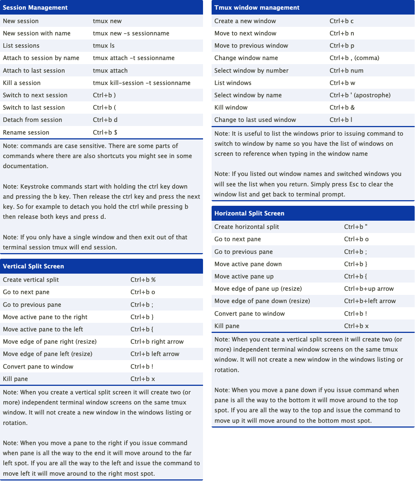
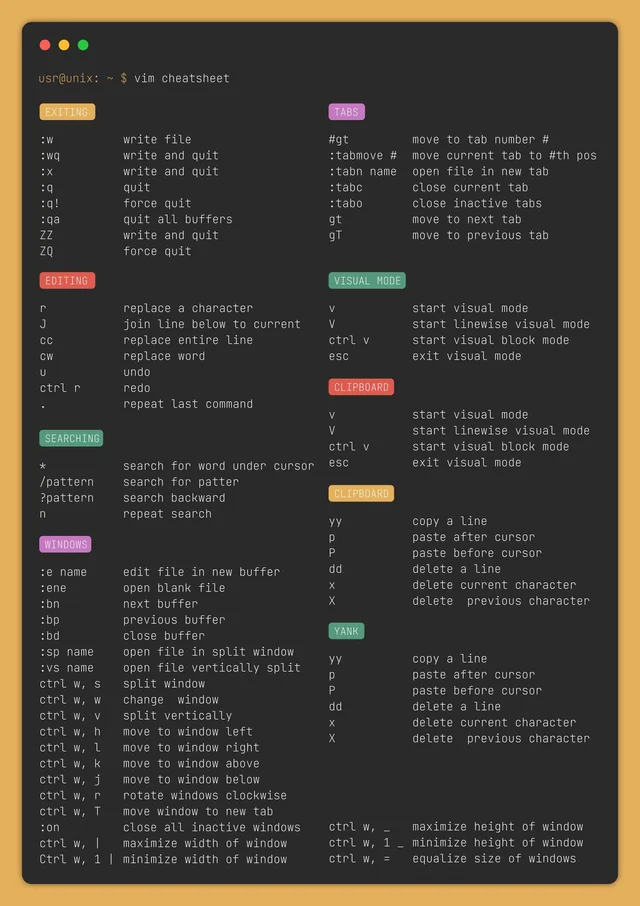

# Cheatsheets

## Tmux

-   [Source](https://www.reddit.com/r/linux4noobs/comments/wqlkuy/cheatsheet_with_tmux_shortcuts/)

    

-   [Source](https://gist.github.com/zcourts/1ed185d3a60acc77855b24fc006af0a8)

    

-   [Source](https://cheatography.com/atomicsupergeek/cheat-sheets/tmux/)

    

-   [tmuxcheatsheet.com](https://tmuxcheatsheet.com/)

## Vim

-   [Source](https://www.reddit.com/r/vimporn/comments/owz5wz/a_beautiful_vim_cheatsheet_created_by_me/)
    

-   [devhints.io](https://devhints.io/vim)
