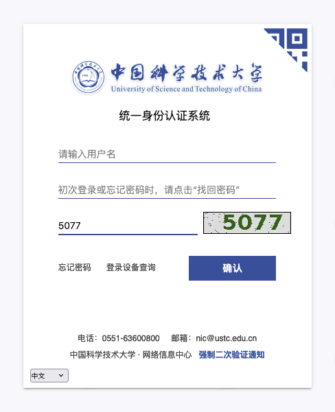
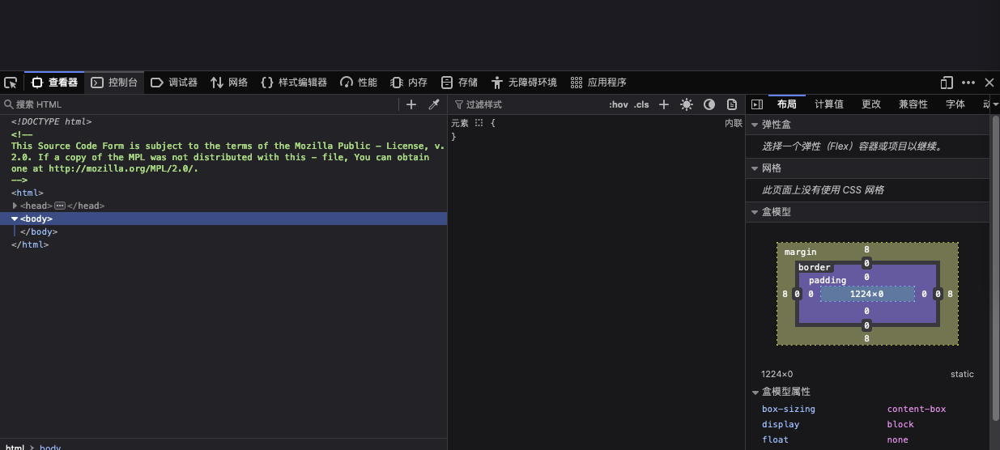
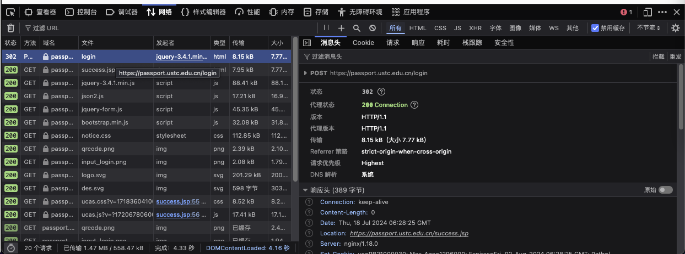
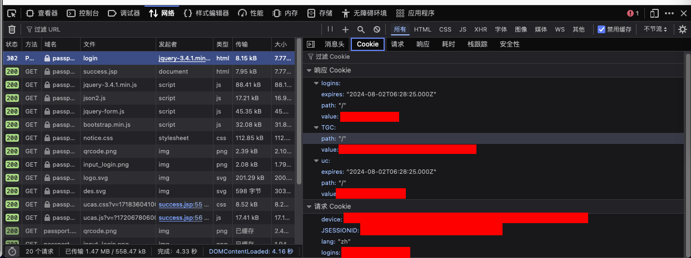
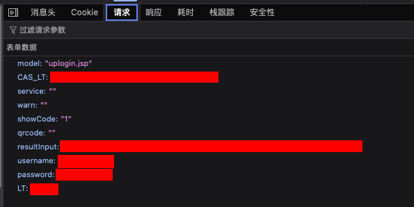

# 学在科大 v2.1.0+ 登录指南

!!! comment

    背景: 在 2024.07.15 「统一身份认证」[更新了短信验证码](https://passport.ustc.edu.cn/doc/notice.html#id2).

    学在科大 iOS 版本在 v2.1.0 版本中同步了这一变化. 其中需要您手动抓取两个值 `deviceID` & `fingerprint`, 本文将指导您如何获取这两个值.

    如果您需要在其他项目中利用类似的逻辑, 可以参考 [这里的 Python 例子](https://github.com/xzkd-project/xzkd-static/commit/448e13cb4195215928b19cabb5a2b5e4fbf4d04c). Swift 代码限于 NIC 要求暂不能更新.

!!! note

    在下面的操作中，我们推荐使用 [vlab](https://vlab.ustc.edu.cn) 来获得一个稳定的网络、浏览器环境，来避免指纹、IP 变化等; 我们推荐使用 Firefox 浏览器, 其他 Chromium 类浏览器也可以使用类似的步骤.

!!! warning

    请注意, 在后面的更新中, NIC (网络信息中心) 可能对登录方式做其他更新、风险控制等; 我们对 [passport.ustc.edu.cn](https://passport.ustc.edu.cn) 不支持 TOTP 等 2FA 方法表示遗憾. 我们提醒您关注由此带来的安全风险、可用性降级等问题.

    不要泄露以下任何一个值，这可能导致您的账号被盗用. 请不要截图、分享下面开发者工具中的任何信息, 除非您知道您在做什么.

    **绕过 2FA 本身就是一种风险行为**, 请自担风险。「学在科大」承诺不以任何方式采集您任何信息，也不做任何 telemetry、或使用第三方分析工具。您可通过网络抓包、源代码审查等方式验证，地址位于 <https://github.com/xzkd-project/xzkd-ios-oss>.

    再次强调，由于当前方法并不完全模拟浏览器时序、更新也难免滞后，NIC 理论上仍存在检测这种登录方法的可能，并可能伴随的其他问题 (例如 v2.0.9 中反复发送验证码的问题). **请自担风险**.

## Steps

-   打开 [passport.ustc.edu.cn/login](https://passport.ustc.edu.cn/login)

    <!--  -->

-   按下 `F12` 打开开发者工具

    

-   选择 `Network` 选项卡

    

-   输入您的用户名、密码、验证码，点击登录
-   在 `Network` 选项卡中找到 `login` 请求，点击它

    

-   在右侧的 `Cookie` 选项卡中找到 `device`, 复制它后面的值，这就是 `deviceID`

    

-   不要退出这个界面，在右侧的 `请求` 选项卡中，找到表单数据中 `resultInput` 的值，这就是 `fingerprint`

    
