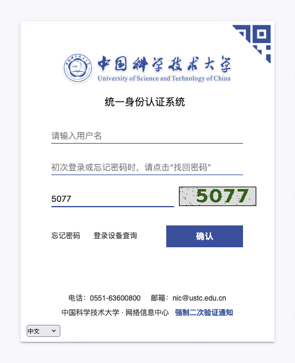
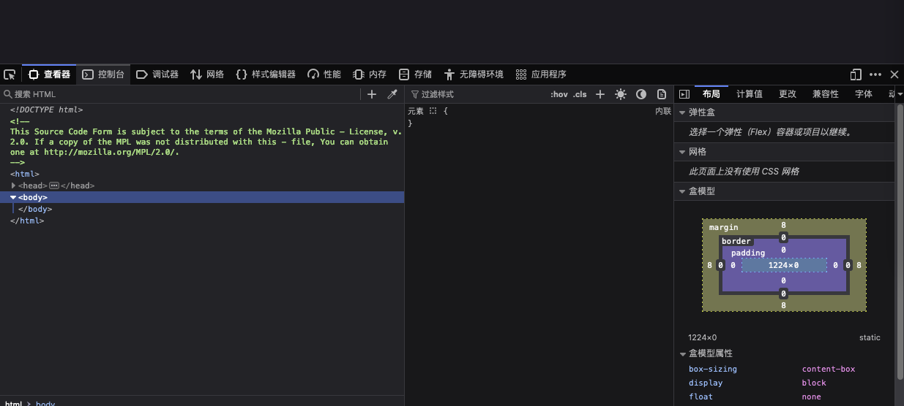
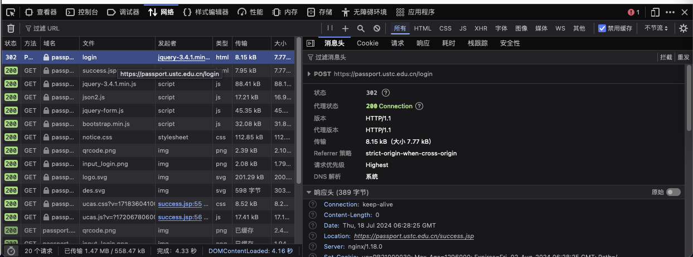
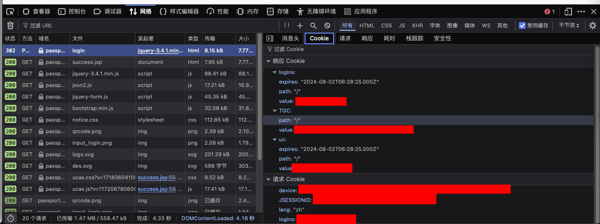
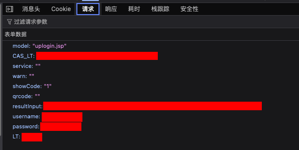

# 学在科大 v2.1.0 登录指南

!!! comment

    背景: 在 2024.07.15 「统一身份认证」[更新了短信验证码](https://passport.ustc.edu.cn/doc/notice.html#id2).

    学在科大 iOS 版本在 v2.1.0 版本中同步了这一变化. 其中需要您手动抓取两个值 `deviceID` & `fingerprint`, 本文将指导您如何获取这两个值.

!!! warning

    请注意, 在后面的更新中, NIC (网络信息中心) 可能对登录方式做其他更新、风险控制等; 我们对 [passport.ustc.edu.cn](https://passport.ustc.edu.cn) 不支持 TOTP 等 2FA 方法表示遗憾.

    我们提醒您关注由此带来的安全风险、可用性降级等问题.

!!! note

    在下面的操作中，我们推荐使用 [vlab](https://vlab.ustc.edu.cn) 来获得一个稳定的网络、浏览器环境，来避免指纹、IP 变化等; 我们推荐使用 Firefox 浏览器, 其他 Chromium 类浏览器也可以使用类似的步骤.

## Steps

-   打开 [passport.ustc.edu.cn/login](https://passport.ustc.edu.cn/login)

    <!--  -->

-   按下 `F12` 打开开发者工具

    

-   选择 `Network` 选项卡

    

-   输入您的用户名、密码、验证码，点击登录
-   在 `Network` 选项卡中找到 `login` 请求，点击它

    

-   在右侧的 `Cookie` 选项卡中找到 `device`, 复制它后面的值，这就是 `deviceID`

    

-   不要退出这个界面，在右侧的 `请求` 选项卡中，找到表单数据中 `resultInput` 的值，这就是 `fingerprint`

    

!!! warning

    不要泄露以上任何一个值，这可能导致您的账号被盗用. 绕过 2FA 本身就是一种风险行为, 请自担风险.
