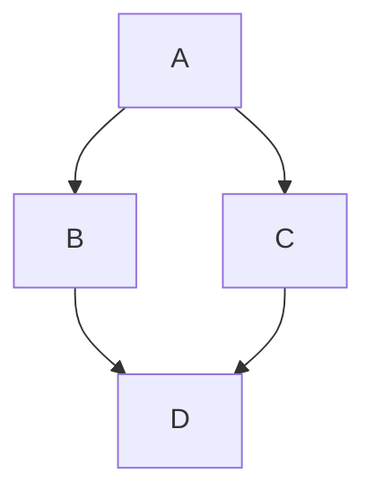

# Test

## Equation

$$
\begin{align*}
\text{Einstein's equation:} && R_{\mu\nu} - \frac{1}{2}g_{\mu\nu}R + g_{\mu\nu}\Lambda &= \frac{8\pi G}{c^4}T_{\mu\nu} \\
\end{align*}
$$

## Code

```python hl_lines="1 4"
def f(x):
    return x**2

print(f(3))
```

## Table

| 1   | 2   | 3   |
| --- | --- | --- |
| 4   | 5   | 6   |
| 7   | 8   | 9   |

## Image

{ #loading=lazy }

## Mermaid



## Link Test {#link-test}

[Return to Home](../index.md)

## More with [typst-svgs](https://github.com/tiankaima/typst-svgs)


