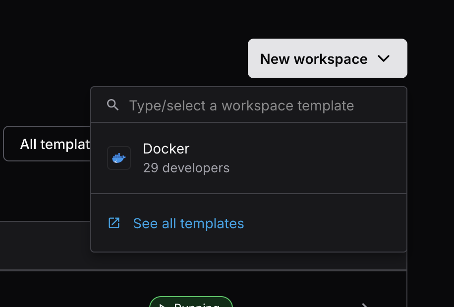
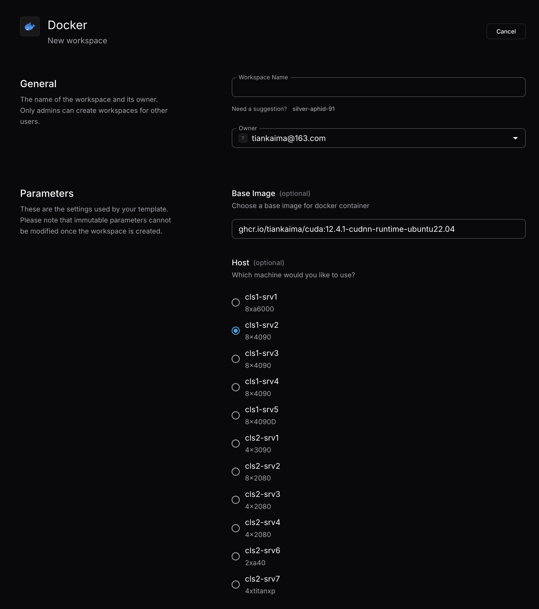

# Coder {#coder}

## 用途 {#purpose}

Coder 为每位用户创建 [Docker](../services/docker/) 工作区。

访问地址为 `https://coder.lab.tiankaima.cn:8443/`。

## 使用流程 {#usage}

1. 访问 Coder，点击 **New Workspace**，选择 Docker
2. 设置 **Workspace Name**、**Base Image** 和 **Host**
3. 创建工作区，使用网页 Terminal、SSH 或 VS Code 连接
4. 在容器内建立 Python 环境并验证 GPU

{width=400}

{width=800}

基础镜像为 `ghcr.io/tiankaima/cuda:12.4.1-cudnn-runtime-ubuntu22.04`。镜像包含 CUDA
用户态库，NVIDIA 驱动由宿主机提供。

在工作区中验证 Python 和 GPU：

```shell
conda create -n example python=3.12
conda activate example
pip install torch torchvision torchaudio
python -c "import torch; print(torch.cuda.is_available())"
```

## 服务实现 {#implementation}

```yaml title="/srv/docker/coder/docker-compose.yaml"
services:
  coder:
    image: ghcr.io/coder/coder:latest
    container_name: coder
    restart: unless-stopped
    network_mode: "host"
    volumes:
      - /var/run/docker.sock:/var/run/docker.sock
      - /var/run/docker/:/var/run/docker/
    env_file:
      - ./coder.env
    environment:
      CODER_PG_CONNECTION_URL: "postgresql://${POSTGRES_USER:-coder}:${POSTGRES_PASSWORD:-***}@127.0.0.1/${POSTGRES_DB:-coder}?sslmode=disable"
    group_add:
      - 988
    depends_on:
      database:
        condition: service_healthy

  database:
    image: postgres:16
    container_name: coder-database
    restart: unless-stopped
    network_mode: "host"
    environment:
      POSTGRES_USER: ${POSTGRES_USER:-coder}
      POSTGRES_PASSWORD: ${POSTGRES_PASSWORD:-***}
      POSTGRES_DB: ${POSTGRES_DB:-coder}
      POSTGRES_PORT: ${POSTGRES_PORT:-tcp://127.0.0.1:5432}
    volumes:
      - ./pg-data:/var/lib/postgresql/data
    healthcheck:
      test: ["CMD-SHELL", "pg_isready -U ${POSTGRES_USER:-coder} -d ${POSTGRES_DB:-coder}"]
      interval: 5s
      timeout: 5s
      retries: 5
```

Coder 容器直接挂载 Docker socket。
