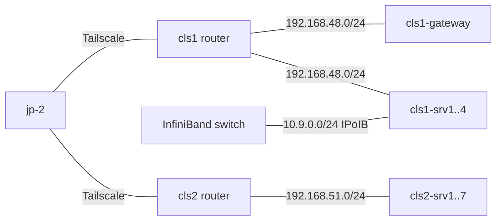

# 拓扑 {#network}

- Headscale 管理跨机房的 Tailscale 网络。
- 控制面运行在 `jp-2`，机房路由器发布物理网段。
- 配置见 [Headscale](../services/headscale/) 和 [DERP](../services/derp/)。

## 地址规划 {#address-plan}

| 网段 | 用途 | 说明 |
| --- | --- | --- |
| `192.168.48.0/24` | `cls1` 机房 | 网关、服务器和 IPMI 使用固定规划 |
| `192.168.51.0/24` | `cls2` 机房 | 主要使用 DHCP，并在路由器侧固定绑定 |
| `10.9.0.0/24` | `cls1` IPoIB | RDMA/InfiniBand 链路 |

| 地址 | 主机 |
| --- | --- |
| `192.168.48.1` | `cls1-gateway` |
| `192.168.48.10X` | IPMI |
| `192.168.48.20X` | `cls1-srvX` |

`cls2` 服务器地址以路由器的 DHCP 绑定为准。

## 网络拓扑 {#topology}

