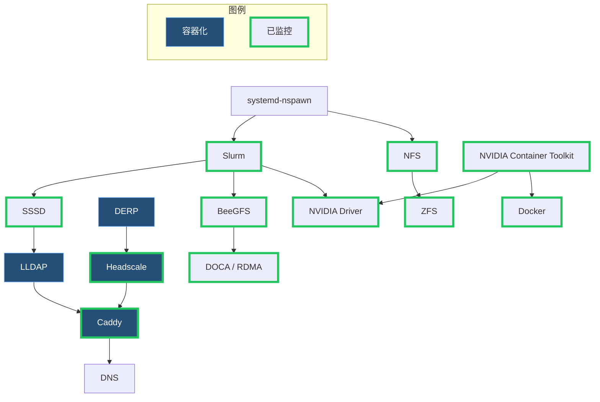

# 服务 {#services}

## 依赖关系 {#dependencies}

所有服务器先完成[服务器设置](../server/setup.md#server-setup)和网络配置。

## 部署位置 {#deployments}

| 服务 | `cls1-gateway` | `login` | GPU 计算节点 | `jp-2` |
| --- | :---: | :---: | :---: | :---: |
| [systemd-nspawn](./systemd-nspawn/) | ☑ | | | |
| [监控](./monitoring/) | ☑ | | ☑ | ☑ |
| [Postfix](./postfix/) | ☑ | ☑ | ☑ | |
| [Slurm](./slurm/) | ☑ | ☑ | ☑ | |
| [SSSD](./sssd/) | ☑ | ☑ | ☑ | ☑ |
| [LLDAP](./lldap/) | | | | ☑ |
| [NFS](./nfs/) | ☑ | | | |
| [BeeGFS](./beegfs/) | ☑ | | ☑ | |
| [ZFS](./zfs/) | ☑ | | | |
| [DERP](./derp/) | ☑ | | | ☑ |
| [Headscale](./headscale/) | | | | ☑ |
| [Caddy](./caddy/) | ☑ | | | ☑ |
| [NVIDIA Container Toolkit](./nvidia-container-toolkit/) | | | ☑ | |
| [NVIDIA Driver](./nvidia-driver/) | | | ☑ | |
| [Docker](./docker/) | ☑ | | ☑ | ☑ |
| [DOCA / RDMA](./doca/) | | | ☑ | |
| [DNS](./dns/) | | | | |
