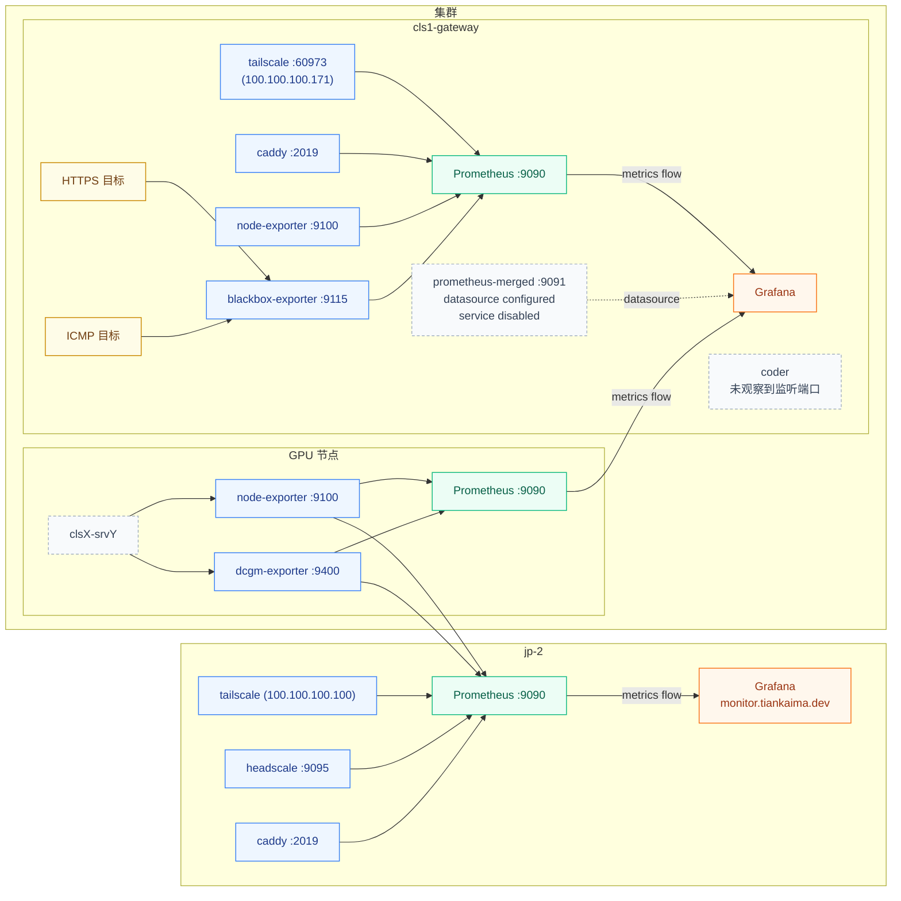

# 监控

## 运行与展示链路



## 配置文件

=== "jp-2"

    === "docker-compose.yml"

        ```yaml title="/srv/docker/monitor/docker-compose.yml"
        services:
          node-exporter:
            image: prom/node-exporter:latest
            container_name: monitor-node-exporter
            restart: always
            network_mode: host
            pid: "host"
            volumes:
              - "/:/host:ro,rslave"
            command:
              - "--path.rootfs=/host"
          
          blackbox-exporter:
            image: prom/blackbox-exporter:latest
            container_name: monitor-blackbox-exporter
            restart: always
            network_mode: host
            privileged: true
            cap_add:
              - NET_RAW
            volumes:
              - /srv/docker/monitor/blackbox-exporter/conf/blackbox.yml:/etc/blackbox_exporter/blackbox.yml:ro
            command:
              - "--config.file=/etc/blackbox_exporter/blackbox.yml"

          # alertmanager:
          #   image: prom/alertmanager:latest
          #   container_name: monitor-alertmanager
          #   restart: always
          #   network_mode: host
          #   volumes:
          #     - /srv/docker/monitor/alertmanager/alertmanager.yml:/etc/alertmanager/alertmanager.yml:ro
          #   command:
          #     - "--config.file=/etc/alertmanager/alertmanager.yml"

          prometheus:
            image: prom/prometheus:latest
            container_name: monitor-prometheus
            restart: always
            network_mode: host
            volumes:
              - /srv/docker/monitor/prometheus/conf/prometheus.yml:/etc/prometheus/prometheus.yml:ro
              # - /srv/docker/monitor/prometheus/conf/alert_rules.yml:/etc/prometheus/alert_rules.yml:ro
              - /srv/docker/monitor/prometheus/data:/prometheus/data
            command:
              - "--config.file=/etc/prometheus/prometheus.yml"
              - "--web.enable-lifecycle"
            depends_on:
              - node-exporter
              # - alertmanager

          grafana:
            image: grafana/grafana:nightly
            container_name: monitor-grafana
            restart: always
            network_mode: host
            volumes:
              - /srv/docker/monitor/grafana/data:/var/lib/grafana
            depends_on:
              - prometheus
            environment:
              - GF_SERVER_ROOT_URL=https://monitor.tiankaima.dev/
              - GF_SERVER_DOMAIN=monitor.tiankaima.dev
              - GF_SECURITY_ADMIN_USER=${GRAFANA_ADMIN_USER}
              - GF_SECURITY_ADMIN_PASSWORD=${GRAFANA_ADMIN_PASSWORD}
              - GF_USERS_ALLOW_SIGN_UP=false
              - GF_AUTH_ANONYMOUS_ENABLED=true
              - GF_AUTH_ANONYMOUS_ORG_ROLE=Viewer
        ```

    === "blackbox.yml"

        ```yaml title="/srv/docker/monitor/blackbox-exporter/conf/blackbox.yml"
        modules:
          https_tls_ipv4:
            prober: http
            timeout: 15s
            http:
              method: GET
              valid_http_versions: ["HTTP/1.1", "HTTP/2.0"]
              valid_status_codes: [200, 301, 302]
              fail_if_not_ssl: true
              preferred_ip_protocol: ip4
              follow_redirects: true

          https_tls_ipv6:
            prober: http
            timeout: 15s
            http:
              method: GET
              valid_http_versions: ["HTTP/1.1", "HTTP/2.0"]
              valid_status_codes: [200, 301, 302]
              fail_if_not_ssl: true
              preferred_ip_protocol: ip6
              follow_redirects: true

          ping_ipv4:
            prober: icmp
            timeout: 5s
            icmp:
              preferred_ip_protocol: ip4

          ping_ipv6:
            prober: icmp
            timeout: 5s
            icmp:
              preferred_ip_protocol: ip6
        ```

    === "prometheus.yml"

        ```yaml title="/srv/docker/monitor/prometheus/conf/prometheus.yml"
        global:
          scrape_interval: 15s

        alerting:
          alertmanagers:
            - static_configs:
                - targets: ['localhost:9093']

        #rule_files:
        #- alert_rules.yml

        #remote_write:
        #  - url: <redacted>
        #    basic_auth:
        #      username: <redacted>
        #      password: <redacted>

        scrape_configs:
          - job_name: 'node_exporter'
            static_configs:
              - targets:
                  - cls1-gateway:9100
                  - cls1-srv1:9100
                  - cls1-srv2:9100
                  - cls1-srv3:9100
                  - cls1-srv4:9100
                  - cls2-srv1:9100
                  - cls2-srv2:9100
                  - cls2-srv3:9100
                  - cls2-srv4:9100
                  - cls2-srv5:9100
                  - cls2-srv6:9100
                  - cls2-srv7:9100

          - job_name: 'dcgm_exporter'
            static_configs:
              - targets:
                  - cls1-srv1:9400
                  - cls1-srv2:9400
                  - cls1-srv3:9400
                  - cls1-srv4:9400
                  - cls2-srv1:9400
                  - cls2-srv2:9400
                  - cls2-srv3:9400
                  - cls2-srv4:9400
                  - cls2-srv6:9400
                  - cls2-srv7:9400

          - job_name: 'blackbox_https_sites_ipv4'
            metrics_path: /probe
            params:
              module: [https_tls_ipv4]
            static_configs:
              - targets:
                  - https://headscale.lab.tiankaima.cn/health
            relabel_configs:
              - source_labels: [__address__]
                target_label: __param_target
              - source_labels: [__param_target]
                target_label: instance
              - target_label: __address__
                replacement: localhost:9115

          - job_name: 'blackbox_https_sites_ipv6'
            metrics_path: /probe
            params:
              module: [https_tls_ipv6]
            static_configs:
              - targets:
                  - https://headscale.lab.tiankaima.cn/health
            relabel_configs:
              - source_labels: [__address__]
                target_label: __param_target
              - source_labels: [__param_target]
                target_label: instance
              - target_label: __address__
                replacement: localhost:9115

          - job_name: 'blackbox_ping_cluster_ipv4'
            metrics_path: /probe
            params:
              module: [ping_ipv4]
            static_configs:
              - targets:
                  - cls1-gateway
                  - cls1-srv1
                  - cls1-srv2
                  - cls1-srv3
                  - cls1-srv4
                  - cls2-srv1
                  - cls2-srv2
                  - cls2-srv3
                  - cls2-srv4
                  - cls2-srv6
                  - cls2-srv7
            relabel_configs:
              - source_labels: [__address__]
                target_label: __param_target
              - source_labels: [__param_target]
                target_label: instance
              - target_label: __address__
                replacement: localhost:9115

          - job_name: 'blackbox_ping_cluster_ipv6'
            metrics_path: /probe
            params:
              module: [ping_ipv6]
            static_configs:
              - targets:
                  - cls1-gateway
                  - cls1-srv1
                  - cls1-srv2
                  - cls1-srv3
                  - cls1-srv4
                  - cls2-srv1
                  - cls2-srv2
                  - cls2-srv3
                  - cls2-srv4
                  - cls2-srv6
                  - cls2-srv6
                  - cls2-srv7
            relabel_configs:
              - source_labels: [__address__]
                target_label: __param_target
              - source_labels: [__param_target]
                target_label: instance
              - target_label: __address__
                replacement: localhost:9115

          - job_name: 'tailscale'
            static_configs:
              - targets:
                  - 100.100.100.100

          - job_name: 'headscale'
            static_configs:
              - targets:
                  - 127.0.0.1:9095

          - job_name: 'caddy'
            static_configs:
              - targets:
                  - localhost:2019

          - job_name: 'caddy_gateway'
            scheme: https
            static_configs:
              - targets:
                  - coder.lab.tiankaima.cn:8443

          - job_name: 'coder'
            static_configs:
              - targets:
                  - cls1-gateway:2112
        ```

=== "cls1-gateway"

    === "docker-compose.yml"

        ```yaml title="/srv/docker/monitor/docker-compose.yml"
        services:
          node-exporter:
            image: prom/node-exporter
            container_name: monitor-node-exporter
            restart: always
            pid: "host"
            network_mode: "host"
            volumes:
              - "/:/host:ro,rslave"
            command:
              - "--path.rootfs=/host"

          blackbox-exporter:
            image: prom/blackbox-exporter:latest
            container_name: monitor-blackbox-exporter
            restart: always
            network_mode: "host"
            privileged: true
            cap_add:
              - NET_RAW
            volumes:
              - /srv/docker/monitor/blackbox-exporter/conf/blackbox.yml:/etc/blackbox_exporter/blackbox.yml:ro
            command:
              - "--config.file=/etc/blackbox_exporter/blackbox.yml"

          prometheus:
            image: prom/prometheus
            container_name: monitor-prometheus
            restart: always
            network_mode: "host"
            volumes:
              - /srv/docker/monitor/prometheus/conf:/etc/prometheus
              - /srv/docker/monitor/prometheus/data:/prometheus
            depends_on:
              - node-exporter
              - blackbox-exporter

                #prometheus-merged:
                #image: prom/prometheus
                #container_name: monitor-prometheus-merged
                #restart: always
                #network_mode: "host"
                #volumes:
                #- /srv/docker/monitor/prometheus.merged/config:/etc/prometheus
                #- /srv/docker/monitor/prometheus.merged/data:/prometheus
                #command: --web.listen-address=:9091 --config.file=/etc/prometheus/prometheus.yml
                #depends_on:
                #- node-exporter

          grafana:
            image: grafana/grafana-oss
            container_name: monitor-grafana
            restart: always
            volumes:
              - /srv/docker/monitor/grafana/grafana.ini:/etc/grafana/grafana.ini
              - /srv/docker/monitor/grafana/data:/var/lib/grafana
              - /srv/docker/monitor/grafana/log:/var/log/grafana
            depends_on:
              - prometheus
            environment:
              - https_proxy=http://grafana.proxy.lab.tiankaima.cn:7890
              - http_proxy=http://grafana.proxy.lab.tiankaima.cn:7890
              - HTTPS_PROXY=http://grafana.proxy.lab.tiankaima.cn:7890
              - HTTP_PROXY=http://grafana.proxy.lab.tiankaima.cn:7890
              - no_proxy=*.cn,10.9.0.1/24,192.168.48.1/22,cls1-srv1,cls1-srv2,cls1-srv3,cls1-srv4,cls1-srv5,cls2-srv1,cls2-srv2,cls2-srv3,cls2-srv4,cls2-srv5,cls2-srv6,cls2-srv7
            network_mode: "host"
        ```

    === "blackbox.yml"

        ```yaml title="/srv/docker/monitor/blackbox-exporter/conf/blackbox.yml"
        modules:
          https_tls_ipv4:
            prober: http
            timeout: 15s
            http:
              method: GET
              valid_http_versions: ["HTTP/1.1", "HTTP/2.0"]
              valid_status_codes: [200, 301, 302]
              fail_if_not_ssl: true
              preferred_ip_protocol: ip4
              follow_redirects: true

          https_tls_ipv6:
            prober: http
            timeout: 15s
            http:
              method: GET
              valid_http_versions: ["HTTP/1.1", "HTTP/2.0"]
              valid_status_codes: [200, 301, 302]
              fail_if_not_ssl: true
              preferred_ip_protocol: ip6
              follow_redirects: true

          ping_ipv4:
            prober: icmp
            timeout: 5s
            icmp:
              preferred_ip_protocol: ip4

          ping_ipv6:
            prober: icmp
            timeout: 5s
            icmp:
              preferred_ip_protocol: ip6
        ```

    === "prometheus.yml"

        ```yaml title="/srv/docker/monitor/prometheus/conf/prometheus.yml"
        # my global config
        global:
          scrape_interval: 5s
          evaluation_interval: 15s

        alerting:
          alertmanagers:
            - static_configs:
                - targets:
                  # - alertmanager:9093

        rule_files:
          # - "first_rules.yml"
          # - "second_rules.yml"

        scrape_configs:
          - job_name: "prometheus"
            static_configs:
              - targets: ["localhost:9090"]

          - job_name: "node"
            static_configs:
              - targets:
                  - "localhost:9100"
                  - "localhost:9400"

          - job_name: "blackbox_https_sites_ipv4"
            metrics_path: /probe
            params:
              module: ["https_tls_ipv4"]
            static_configs:
              - targets:
                  - "https://headscale.lab.tiankaima.cn/health"
            relabel_configs:
              - source_labels: [__address__]
                target_label: __param_target
              - source_labels: [__param_target]
                target_label: instance
              - target_label: __address__
                replacement: localhost:9115

          - job_name: "blackbox_https_sites_ipv6"
            metrics_path: /probe
            params:
              module: ["https_tls_ipv6"]
            static_configs:
              - targets:
                  - "https://headscale.lab.tiankaima.cn/health"
            relabel_configs:
              - source_labels: [__address__]
                target_label: __param_target
              - source_labels: [__param_target]
                target_label: instance
              - target_label: __address__
                replacement: localhost:9115

          - job_name: "blackbox_ping_cluster_ipv4"
            metrics_path: /probe
            params:
              module: ["ping_ipv4"]
            static_configs:
              - targets:
                  - "cls1-gateway"
                  - "cls1-srv1"
                  - "cls1-srv2"
                  - "cls1-srv3"
                  - "cls1-srv4"
                  - "cls2-srv1"
                  - "cls2-srv2"
                  - "cls2-srv3"
                  - "cls2-srv4"
                  - "cls2-srv6"
                  - "cls2-srv7"
            relabel_configs:
              - source_labels: [__address__]
                target_label: __param_target
              - source_labels: [__param_target]
                target_label: instance
              - target_label: __address__
                replacement: localhost:9115

          - job_name: "blackbox_ping_cluster_ipv6"
            metrics_path: /probe
            params:
              module: ["ping_ipv6"]
            static_configs:
              - targets:
                  - "cls1-gateway"
                  - "cls1-srv1"
                  - "cls1-srv2"
                  - "cls1-srv3"
                  - "cls1-srv4"
                  - "cls2-srv1"
                  - "cls2-srv2"
                  - "cls2-srv3"
                  - "cls2-srv4"
                  - "cls2-srv6"
                  - "cls2-srv7"
            relabel_configs:
              - source_labels: [__address__]
                target_label: __param_target
              - source_labels: [__param_target]
                target_label: instance
              - target_label: __address__
                replacement: localhost:9115
        ```

=== "cls 节点"

    === "monitor / docker-compose.yml"

        ```yaml title="cls1-srv1:/srv/docker/monitor/docker-compose.yml"
        services:
          dcgm-exporter:
            image: nvidia/dcgm-exporter:4.4.0-4.5.0-ubuntu22.04
            container_name: monitor-dcgm-exporter
            restart: always
            deploy:
              resources:
                reservations:
                  devices:
                    - capabilities: ["gpu"]
            cap_add:
              - SYS_ADMIN
            pid: "host"
            network_mode: "host"

          node-exporter:
            image: prom/node-exporter
            container_name: monitor-node-exporter
            restart: always
            pid: "host"
            network_mode: "host"
            volumes:
              - "/:/host:ro,rslave"
            command:
              - "--path.rootfs=/host"

          prometheus:
            image: prom/prometheus
            container_name: monitor-prometheus
            restart: always
            network_mode: "host"
            volumes:
              - /srv/docker/monitor/prometheus/config:/etc/prometheus
              - /srv/docker/monitor/prometheus/data:/prometheus
            depends_on:
              - node-exporter
              - dcgm-exporter
        ```

    === "GPU Prometheus"

        ```yaml title="/srv/docker/monitor/prometheus/config/prometheus.yml"
        # my global config
        global:
          scrape_interval: 5s
          evaluation_interval: 15s

        alerting:
          alertmanagers:
            - static_configs:
                - targets:
                  # - alertmanager:9093

        rule_files:
          # - "first_rules.yml"
          # - "second_rules.yml"

        scrape_configs:
          - job_name: "prometheus"
            static_configs:
              - targets: ["localhost:9090"]
          - job_name: "node"
            static_configs:
              - targets:
                  - "localhost:9100"
                  - "localhost:9400"
        ```

    === "No-GPU Prometheus"

        ```yaml title="/srv/docker/monitor/prometheus/config/prometheus.yml"
        # my global config
        global:
          scrape_interval: 5s
          evaluation_interval: 15s

        alerting:
          alertmanagers:
            - static_configs:
                - targets:
                  # - alertmanager:9093

        rule_files:
          # - "first_rules.yml"
          # - "second_rules.yml"

        scrape_configs:
          - job_name: "prometheus"
            static_configs:
              - targets: ["localhost:9090"]
          - job_name: "node"
            static_configs:
              - targets:
                  - "localhost:9100"
        ```