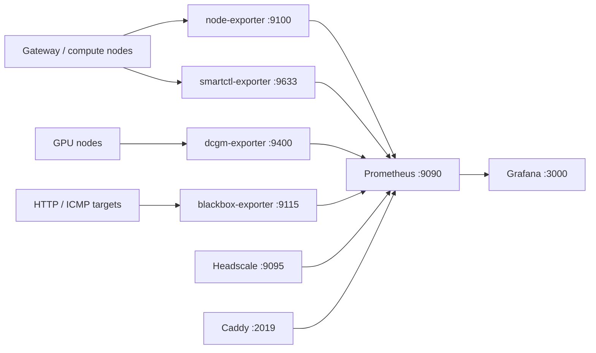

# 监控 {#monitoring}

| 项目 | 内容 |
| --- | --- |
| 部署位置 | 聚合服务位于 `jp-2`，exporter 位于 `cls1-gateway` 和计算节点 |
| 依赖 | [Docker](../docker/)、[Caddy](../caddy/)、[Postfix](../postfix/)、跨机房网络、[DNS](../dns/) |
| 采集对象 | node exporter、DCGM exporter、smartctl exporter、blackbox exporter、服务端点 |

用户通过 <https://grafana.lab.tiankaima.cn:8443/> 查看 Grafana。

## 搭建 {#monitoring-setup}

### 准备项目目录 {#prepare-monitoring-directories}

所有被监控节点创建 exporter 和本地 Prometheus 使用的目录：

```shell
sudo install -d -o root -g root -m 0755 \
  /srv/docker/monitor/blackbox-exporter/conf \
  /srv/docker/monitor/prometheus/config \
  /srv/docker/monitor/prometheus/data \
  /var/lib/node_exporter/textfile_collector
sudo chown 65534:65534 /srv/docker/monitor/prometheus/data
```

`jp-2` 使用 `prometheus/conf`，并增加 Grafana 数据和 provisioning 目录：

```shell
sudo install -d -o root -g root -m 0755 \
  /srv/docker/monitor/blackbox-exporter/conf \
  /srv/docker/monitor/prometheus/conf \
  /srv/docker/monitor/prometheus/data \
  /srv/docker/monitor/grafana/data \
  /srv/docker/monitor/grafana/provisioning/alerting \
  /srv/docker/monitor/grafana/provisioning/dashboards \
  /srv/docker/monitor/grafana/provisioning/datasources \
  /srv/docker/monitor/grafana/dashboards
sudo chown 65534:65534 /srv/docker/monitor/prometheus/data
sudo chown 472:472 /srv/docker/monitor/grafana/data
```

`jp-2` 的 `.env` 保存 Grafana 管理员账号。管理员密码使用 `openssl rand -base64 32` 生成：

```bash title="/srv/docker/monitor/.env"
GRAFANA_ADMIN_USER=REPLACE_WITH_ADMIN_USER
GRAFANA_ADMIN_PASSWORD=REPLACE_WITH_RANDOM_PASSWORD
```

```shell
sudo chown root:root /srv/docker/monitor/.env
sudo chmod 0600 /srv/docker/monitor/.env
stat -c '%a %U:%G' /srv/docker/monitor/.env
```

检查数据目录的所有者：

```shell
stat -c '%a %u:%g %n' \
  /srv/docker/monitor/prometheus/data \
  /srv/docker/monitor/grafana/data 2>/dev/null
```

### 安装本地采集器 {#install-local-collectors}

本地采集器将 systemd 服务状态、自动更新、[Slurm](../slurm/)、[BeeGFS](../beegfs/) 和 journal 事件写入 node exporter
的 textfile collector 目录。下载以下文件：

- [cluster-monitoring-collect](files/cluster-monitoring-collect)
- [cluster-journal-events](files/cluster-journal-events)
- [cluster-storage-alerts](files/cluster-storage-alerts)
- [cluster-monitoring-collect.service](files/cluster-monitoring-collect.service)
- [cluster-monitoring-collect.timer](files/cluster-monitoring-collect.timer)
- [cluster-journal-events.service](files/cluster-journal-events.service)
- [cluster-journal-events.timer](files/cluster-journal-events.timer)
- [cluster-storage-alerts.service](files/cluster-storage-alerts.service)
- [cluster-storage-alerts.timer](files/cluster-storage-alerts.timer)

安装脚本、systemd 单元和 `jq`：

```shell
sudo apt-get update
sudo apt-get install jq
sudo install -d -o root -g root -m 0755 \
  /etc/cluster-monitoring /var/lib/node_exporter/textfile_collector
sudo install -d -o root -g root -m 0700 /var/lib/cluster-monitoring
sudo install -o root -g root -m 0755 \
  cluster-monitoring-collect cluster-journal-events cluster-storage-alerts \
  /usr/local/sbin/
sudo install -o root -g root -m 0644 \
  cluster-monitoring-collect.service cluster-monitoring-collect.timer \
  cluster-journal-events.service cluster-journal-events.timer \
  cluster-storage-alerts.service cluster-storage-alerts.timer \
  /etc/systemd/system/
```

`collectors.conf` 决定当前主机运行哪些集群检查：

=== "cls1-gateway"

    ```bash title="/etc/cluster-monitoring/collectors.conf"
    COLLECT_SLURM_CONTROLLER=1
    COLLECT_BEEGFS_HEALTH=1
    COLLECT_BEEGFS_CLIENT=1
    BEEGFS_MOUNT=/data/cls1-beegfs
    ```

=== "cls1-srv1..4"

    ```bash title="/etc/cluster-monitoring/collectors.conf"
    COLLECT_SLURM_CONTROLLER=0
    COLLECT_BEEGFS_HEALTH=0
    COLLECT_BEEGFS_CLIENT=1
    BEEGFS_MOUNT=/data/cls1-beegfs
    ```

=== "其他主机"

    ```bash title="/etc/cluster-monitoring/collectors.conf"
    COLLECT_SLURM_CONTROLLER=0
    COLLECT_BEEGFS_HEALTH=0
    COLLECT_BEEGFS_CLIENT=0
    BEEGFS_MOUNT=/data/cls1-beegfs
    ```

`expected-units` 每行写一个必须处于 active 状态的 systemd 单元。所有服务器包含以下单元：

```text title="/etc/cluster-monitoring/expected-units"
ssh.service
sssd.service
fail2ban.service
docker.service
containerd.service
systemd-timesyncd.service
apt-daily.timer
apt-daily-upgrade.timer
unattended-upgrades.service
cluster-journal-events.timer
```

根据主机职责追加单元：

| 主机职责 | 追加的单元 |
| --- | --- |
| Slurm controller | `munge.service`、`slurmctld.service`、`slurmdbd.service` |
| Slurm compute | `munge.service`、`slurmd.service` |
| BeeGFS management | `beegfs-client.service`、`beegfs-mgmtd.service` |
| BeeGFS metadata 和 storage | `beegfs-client.service`、`beegfs-meta.service`、`beegfs-storage.service` |
| [NFS](../nfs/) server | `nfs-server.service` |
| [ZFS](../zfs/) server | `zfs-zed.service` |
| GPU compute | `nvidia-persistenced.service` |

检查脚本和单元后启用三个 timer：

```shell
sudo chown root:root /etc/cluster-monitoring/collectors.conf \
  /etc/cluster-monitoring/expected-units
sudo chmod 0644 /etc/cluster-monitoring/collectors.conf \
  /etc/cluster-monitoring/expected-units
for script in \
  /usr/local/sbin/cluster-monitoring-collect \
  /usr/local/sbin/cluster-journal-events \
  /usr/local/sbin/cluster-storage-alerts; do
  sudo bash -n "$script"
done
sudo systemd-analyze verify \
  /etc/systemd/system/cluster-monitoring-collect.service \
  /etc/systemd/system/cluster-journal-events.service \
  /etc/systemd/system/cluster-storage-alerts.service
sudo systemctl daemon-reload
sudo systemctl enable --now \
  cluster-monitoring-collect.timer \
  cluster-journal-events.timer \
  cluster-storage-alerts.timer
systemctl list-timers \
  cluster-monitoring-collect.timer \
  cluster-journal-events.timer \
  cluster-storage-alerts.timer
sudo systemctl start cluster-monitoring-collect.service cluster-journal-events.service
grep -H '^cluster_' /var/lib/node_exporter/textfile_collector/*.prom | head
```

### 配置告警 {#alert-paths}

告警发送到 Telegram 或 `cls1-gateway` 的 root 本地邮箱：

| 来源 | 检查内容 | 通知位置 |
| --- | --- | --- |
| Prometheus 和 Grafana | 主机、网络、Slurm、GPU、存储和服务指标 | Telegram |
| `cluster-storage-alerts.timer` | 挂载点、磁盘使用率和 ZFS 状态 | `cls1-gateway` 的 root 本地邮箱 |
| smartd | SMART 检查错误 | `cls1-gateway` 的 root 本地邮箱 |

各节点的 `cluster-journal-events.timer` 每分钟读取新增 journal，将 GPU Xid、驱动不匹配、
OOM、I/O、RDMA、BeeGFS、Slurm、[SSSD](../sssd/) 和自动更新错误转换成 Prometheus `counter`。Grafana
根据 `counter` 的增量告警，这些事件通过 Telegram 通知。

`cluster-storage-alerts.timer` 每 30 分钟运行一次，磁盘使用率在 90% 和 95% 分别产生
`warning` 和 `critical`。脚本默认发送给 `root`，当前没有设置 `MAIL_TO` 或 `root` 别名。邮件由各节点的
Postfix 转发到 `cls1-gateway`，最终保存在 `/var/mail/root`，不会发送到外部邮箱。具体配置见
[Postfix](../postfix/)。

检查存储检查脚本。退出状态 `0` 表示没有问题，`1` 表示发现问题：

```shell
sudo /usr/local/sbin/cluster-storage-alerts --no-mail
journalctl -u cluster-storage-alerts.service -n 100 --no-pager
```

### 拓扑 {#topology}



### 节点监控服务 {#node-exporters}

项目目录为 `/srv/docker/monitor`。所有节点运行 node exporter、smartctl exporter、blackbox
exporter 和本地 Prometheus。GPU 节点增加 DCGM exporter。

```yaml title="/srv/docker/monitor/docker-compose.yml"
services:
  node-exporter:
    image: prom/node-exporter:v1.11.1@sha256:e9cff4fc67b1818f8c97adb115b9f12c9a54b533de86765d4a0effc01b357205
    container_name: monitor-node-exporter
    restart: always
    pid: host
    network_mode: host
    volumes:
      - /:/host:ro,rslave
      - /var/lib/node_exporter/textfile_collector:/var/lib/node_exporter/textfile_collector:ro
    command:
      - --path.rootfs=/host
      - --collector.textfile.directory=/var/lib/node_exporter/textfile_collector

  dcgm-exporter:
    image: nvidia/dcgm-exporter:4.4.0-4.5.0-ubuntu22.04@sha256:7da10c9291a097a0021bced2e6912b54b4e57606505a97c586cc106e9fe38ebb
    container_name: monitor-dcgm-exporter
    restart: always
    network_mode: host
    pid: host
    deploy:
      resources:
        reservations:
          devices:
            - capabilities: [gpu]

  smartctl-exporter:
    image: prometheuscommunity/smartctl-exporter:v0.14.0@sha256:a13840e6df4e3c6a3b25c46e15d5156f7c5109acad97f9b92a6955bd658b62c3
    container_name: monitor-smartctl-exporter
    restart: always
    network_mode: host
    privileged: true
    user: root
    command:
      - --web.listen-address=:9633
      - --smartctl.interval=15m
      - --smartctl.rescan=30m

  blackbox-exporter:
    image: prom/blackbox-exporter:v0.28.0@sha256:e753ff9f3fc458d02cca5eddab5a77e1c175eee484a8925ac7d524f04366c2fc
    container_name: monitor-blackbox-exporter
    restart: always
    network_mode: host
    cap_add: [NET_RAW]
    volumes:
      - /srv/docker/monitor/blackbox-exporter/conf/blackbox.yml:/etc/blackbox_exporter/blackbox.yml:ro
    command: ["--config.file=/etc/blackbox_exporter/blackbox.yml"]

  prometheus:
    image: prom/prometheus:v3.13.0@sha256:c6b27ea434f8389bfe233fbc7be381cf50587c286e871bc842008f5a1b1908a7
    container_name: monitor-prometheus
    restart: always
    network_mode: host
    volumes:
      - /srv/docker/monitor/prometheus/config:/etc/prometheus:ro
      - /srv/docker/monitor/prometheus/data:/prometheus
```

节点上的 Prometheus 采集自身和 node exporter：

```yaml title="/srv/docker/monitor/prometheus/config/prometheus.yml"
global:
  scrape_interval: 5s
  evaluation_interval: 15s

scrape_configs:
  - job_name: prometheus
    static_configs:
      - targets: ["127.0.0.1:9090"]
  - job_name: node
    static_configs:
      - targets: ["127.0.0.1:9100"]
```

GPU 节点在 `scrape_configs` 中增加 DCGM exporter：

```yaml title="GPU 节点的 prometheus.yml"
  - job_name: dcgm
    static_configs:
      - targets: ["127.0.0.1:9400"]
```

先启动 node exporter、smartctl exporter 和本地 Prometheus。GPU 节点同时启动 DCGM
exporter：

=== "非 GPU 节点"

    ```shell
    cd /srv/docker/monitor
    docker compose config --quiet
    docker compose up -d node-exporter smartctl-exporter prometheus
    docker compose ps
    curl --fail http://127.0.0.1:9100/metrics >/dev/null
    curl --fail http://127.0.0.1:9633/metrics >/dev/null
    curl --fail http://127.0.0.1:9090/-/healthy
    ```

=== "GPU 节点"

    ```shell
    cd /srv/docker/monitor
    docker compose config --quiet
    docker compose up -d node-exporter smartctl-exporter prometheus dcgm-exporter
    docker compose ps
    curl --fail http://127.0.0.1:9100/metrics >/dev/null
    curl --fail http://127.0.0.1:9633/metrics >/dev/null
    curl --fail http://127.0.0.1:9400/metrics >/dev/null
    curl --fail http://127.0.0.1:9090/-/healthy
    ```

### 聚合服务 {#monitoring-servers}

`jp-2` 还运行 blackbox exporter、Prometheus 和 Grafana：

```yaml title="jp-2:/srv/docker/monitor/docker-compose.yml"
services:
  node-exporter:
    image: prom/node-exporter:v1.11.1@sha256:e9cff4fc67b1818f8c97adb115b9f12c9a54b533de86765d4a0effc01b357205
    container_name: monitor-node-exporter
    restart: always
    pid: host
    network_mode: host
    volumes:
      - /:/host:ro,rslave
      - /var/lib/node_exporter/textfile_collector:/var/lib/node_exporter/textfile_collector:ro
    command:
      - --path.rootfs=/host
      - --collector.textfile.directory=/var/lib/node_exporter/textfile_collector

  blackbox-exporter:
    image: prom/blackbox-exporter:v0.28.0@sha256:e753ff9f3fc458d02cca5eddab5a77e1c175eee484a8925ac7d524f04366c2fc
    container_name: monitor-blackbox-exporter
    restart: always
    network_mode: host
    cap_add: [NET_RAW]
    volumes:
      - /srv/docker/monitor/blackbox-exporter/conf/blackbox.yml:/etc/blackbox_exporter/blackbox.yml:ro
    command: ["--config.file=/etc/blackbox_exporter/blackbox.yml"]

  prometheus:
    image: prom/prometheus:v3.13.0@sha256:c6b27ea434f8389bfe233fbc7be381cf50587c286e871bc842008f5a1b1908a7
    container_name: monitor-prometheus
    restart: always
    network_mode: host
    volumes:
      - /srv/docker/monitor/prometheus/conf/prometheus.yml:/etc/prometheus/prometheus.yml:ro
      - /srv/docker/monitor/prometheus/data:/prometheus/data
    command:
      - --config.file=/etc/prometheus/prometheus.yml
      - --storage.tsdb.path=/prometheus/data
      - --storage.tsdb.retention.time=30d
      - --storage.tsdb.retention.size=20GB
      - --web.enable-lifecycle

  grafana:
    image: grafana/grafana:nightly@sha256:e406a4f9ae6bf26271df13ad74c4bdf94557a9729d08a977f76716a73185978b
    container_name: monitor-grafana
    restart: always
    network_mode: host
    volumes:
      - /srv/docker/monitor/grafana/data:/var/lib/grafana
      - /srv/docker/monitor/grafana/provisioning/datasources:/etc/grafana/provisioning/datasources:ro
      - /srv/docker/monitor/grafana/provisioning/dashboards:/etc/grafana/provisioning/dashboards:ro
      - /srv/docker/monitor/grafana/provisioning/alerting:/etc/grafana/provisioning/alerting:ro
      - /srv/docker/monitor/grafana/dashboards:/var/lib/grafana/dashboards:ro
    environment:
      GF_SECURITY_ADMIN_USER: ${GRAFANA_ADMIN_USER}
      GF_SECURITY_ADMIN_PASSWORD: ${GRAFANA_ADMIN_PASSWORD}
      GF_USERS_ALLOW_SIGN_UP: "false"
      GF_PLUGINS_PREINSTALL_AUTO_UPDATE: "false"
```

配置 Prometheus datasource：

```yaml title="/srv/docker/monitor/grafana/provisioning/datasources/prometheus.yml"
apiVersion: 1

datasources:
  - name: prometheus
    uid: ff4rykbx63t34f
    type: prometheus
    access: proxy
    url: http://127.0.0.1:9090
    isDefault: true
    editable: false
```

写入 Compose 和 datasource 后检查文件：

```shell
cd /srv/docker/monitor
docker compose config --quiet
test -r grafana/provisioning/datasources/prometheus.yml
```

`cls1-gateway` 的 Grafana 使用 host 网络模式。Caddy 将 `:3000` 映射到 `:8443`。
`jp-2` 和 `cls1-gateway` 的 Prometheus 采集目标不同，修改配置前先确认所在主机。

### Prometheus targets {#prometheus-targets}

增删服务器时修改以下 targets：

```yaml title="/srv/docker/monitor/prometheus/conf/prometheus.yml"
global:
  scrape_interval: 15s

scrape_configs:
  - job_name: node_exporter
    static_configs:
      - targets:
          - cls1-gateway:9100
          - cls1-srv1:9100
          - cls1-srv2:9100
          - cls1-srv3:9100
          - cls1-srv4:9100
          - cls2-srv1:9100
          - cls2-srv2:9100
          - cls2-srv3:9100
          - cls2-srv4:9100
          - cls2-srv5:9100
          - cls2-srv6:9100
          - cls2-srv7:9100

  - job_name: dcgm_exporter
    static_configs:
      - targets:
          - cls1-srv1:9400
          - cls1-srv2:9400
          - cls1-srv3:9400
          - cls1-srv4:9400
          - cls2-srv1:9400
          - cls2-srv2:9400
          - cls2-srv3:9400
          - cls2-srv4:9400
          - cls2-srv6:9400
          - cls2-srv7:9400

  - job_name: smartctl_exporter
    static_configs:
      - targets:
          - cls1-gateway:9633
          - cls1-srv1:9633
          - cls1-srv2:9633
          - cls1-srv3:9633
          - cls1-srv4:9633

  - job_name: headscale
    static_configs:
      - targets: [127.0.0.1:9095]

  - job_name: caddy
    static_configs:
      - targets: [127.0.0.1:2019]
```

本机 `curl` 可以读取 exporter 指标后，再添加采集目标。删除已下线节点的采集目标。

检查 Prometheus 配置，重载后查看采集目标：

```shell
cd /srv/docker/monitor
docker compose up -d node-exporter prometheus grafana
docker compose ps
docker exec monitor-prometheus promtool check config /etc/prometheus/prometheus.yml
curl --fail -X POST http://127.0.0.1:9090/-/reload
curl --fail http://127.0.0.1:9090/api/v1/targets >/dev/null
curl --fail http://127.0.0.1:3000/api/health
```

### Blackbox 探测 {#blackbox-exporter}

```yaml title="/srv/docker/monitor/blackbox-exporter/conf/blackbox.yml"
modules:
  https_tls_ipv4:
    prober: http
    timeout: 15s
    http:
      method: GET
      valid_status_codes: [200, 301, 302]
      fail_if_not_ssl: true
      preferred_ip_protocol: ip4
      follow_redirects: true

  ping_ipv4:
    prober: icmp
    timeout: 5s
    icmp:
      preferred_ip_protocol: ip4
```

```yaml title="prometheus.yml（追加到 scrape_configs）"
- job_name: blackbox_https_ipv4
  metrics_path: /probe
  params:
    module: [https_tls_ipv4]
  static_configs:
    - targets:
        - https://headscale.lab.tiankaima.cn/health
        - https://grafana.lab.tiankaima.cn:8443/
  relabel_configs:
    - source_labels: [__address__]
      target_label: __param_target
    - source_labels: [__param_target]
      target_label: instance
    - target_label: __address__
      replacement: 127.0.0.1:9115
```

IPv6 HTTP 和 ICMP 使用独立的 module 和 job。

检查 Blackbox 配置并请求一个探测目标：

```shell
cd /srv/docker/monitor
docker compose up -d blackbox-exporter
docker compose ps blackbox-exporter
docker exec monitor-prometheus promtool check config /etc/prometheus/prometheus.yml
curl --fail --get http://127.0.0.1:9115/probe \
  --data-urlencode 'module=https_tls_ipv4' \
  --data-urlencode 'target=https://headscale.lab.tiankaima.cn/health' >/dev/null
```

在 Prometheus `/targets` 页面检查采集目标，并在 Grafana 中查询节点、GPU、磁盘和服务指标。

## 维护 {#monitoring-maintenance}

### Prometheus 采集目标不可用 {#regular-checks}

```shell
cd /srv/docker/monitor
docker compose ps
docker compose logs --tail=100 prometheus
curl --fail http://127.0.0.1:9090/-/healthy
```

在 Prometheus `/targets` 页面检查目标。目标缺失时检查配置。目标为 `DOWN` 时检查
DNS/Tailscale、端口、exporter 和 relabel。

### Prometheus 配置重载失败 {#configuration-changes}

```shell
docker exec monitor-prometheus promtool check config /etc/prometheus/prometheus.yml
docker compose config --quiet
curl -X POST http://127.0.0.1:9090/-/reload
```

### 监控数据占用空间过大 {#capacity-and-upgrade}

```shell
du -sh /srv/docker/monitor/prometheus/data /srv/docker/monitor/grafana/data
docker compose images
```

根据磁盘容量设置 Prometheus 数据保留时间。

### 升级或迁移监控服务 {#upgrade-or-migrate}

升级 Grafana 前备份数据库并记录镜像摘要。迁移时同时复制 Prometheus 配置、Grafana 数据、
dashboard、alert rule、notification policy 和环境文件。

### 监控指标缺失 {#service-checks}

- 检查 Slurm controller、计算节点状态和指标更新时间
- 检查 BeeGFS health check、客户端挂载和 metadata cache
- 比较 DCGM exporter 和 `nvidia-smi` 的 GPU 数量
- 检查 SMART、文件系统容量和只读状态
- Blackbox 失败时，分别检查目标和探测节点的网络
