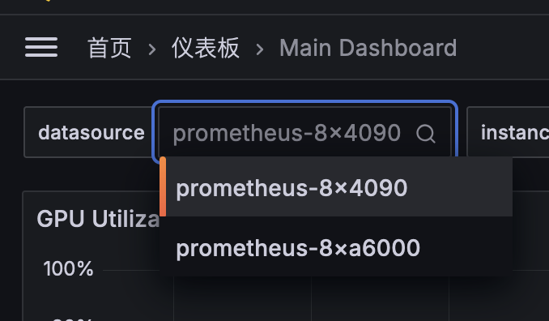

# 8x4090

!!! note "Note: @tiankaima"

    从上架开始就接手的服务器，记录的内容会更全面一点。

    上架检查单 -> [docs/lab/checklist.md](/lab/checklist)

## 监控

<https://grafana.lab.tiankaima.cn:8443/>

配置了 Prometheus + Grafana 来做监控：

- CPU、内存、硬盘、网络流量：`node-exporter`
- GPU 监控：`dcgm-exporter`
- 监控本体：`prometheus`
- 可视化：`grafana`

配置文件参考：<https://gist.github.com/tiankaima/9c31f36435af0c5093704b366d43eea2>

!!! note ""

    + 为 Grafana 开启了「允许未登录」的设置，可以直接访问查看监控数据，只能查看不能修改。
    + 同机房的另一台机器 `8xa6000` 使用了类似的部署方案，但使用这台机器的 grafana 做可视化，在下面的设置中可以切换数据源。

        {width=400}

## Docker 管理

出于安全性、稳定性的考虑，在这台机器上我们延续 8xa6000（可能更早？）的原则，只对实验室同学开放 Docker 容器，而不提供宿主机的访问权限。

在 Coder 多设备部署方案成熟之前，使用了一个脚本进行过渡 -> [docker-management.sh](https://gist.github.com/tiankaima/370bc613ab32980175548afe9bcaa481)

使用方法：

```bash
ssh docker-management@8x4090.srv.lab.tiankaima.cn
```

!!! warning

    + 这只是一个过渡方案，不是最终解决方案，也无意成为 Coder 等方案的替代品。
    + 访问密码请私聊管理员。
    + 在 ssh 脚本创建容器后，脚本会打开这个容器的 shell 以供访问。
    + 脚本会提示连接容器的其他方法（校园网 IP 的端口映射、容器的内网地址等），后续访问无需再次通过此脚本。
    + 进入容器后请更改密码，容器内默认用户名、密码是 -> <https://github.com/tiankaima/Dockerfile/blob/master/cuda/Dockerfile#L27>

## 网络说明

+ 使用如下命令设置代理：

    ```bash
    export http_proxy="http://192.168.50.1:7890";
    export https_proxy=$http_proxy;
    export no_proxy="localhost, 127.0.0.1, ::1"
    ```