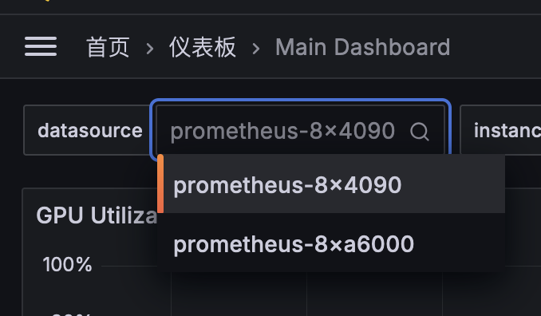

# 使用文档

## 监控

<https://grafana.lab.tiankaima.cn:8443/>

-   为 Grafana 开启了「允许未登录」的设置，可以直接访问查看监控数据，只能查看不能修改。
-   在下面的设置中可以切换数据源。

    {width=400}

## 网络说明

-   使用如下命令设置代理：

    ```bash
    export http_proxy="http://proxy.lab.tiankaima.cn:7890";
    export https_proxy=$http_proxy;
    export no_proxy="localhost, 127.0.0.1, ::1, *.cn"
    ```
