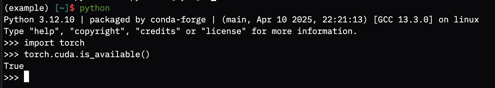

# 使用文档

## Coder

<https://coder.lab.tiankaima.cn:8443/>

> 简单来说我们用 Coder 来为每位同学创建一个自己的 Docker 容器，这是综合下来「使用体验接近物理机」、「性能损失小」以及「维护成本低」的考量。

我们在这里演示从创建 Workspace 到搭建完整 CUDA pyTorch 环境的完整流程：

!!! note

    注册流程在群公告。

1. 访问 <https://coder.lab.tiankaima.cn:8443/>
2. 在下面的位置，点击 New Workspace，选择 Docker：

    {width=400}

3. 依次设置 Workspace Name、Base Image 和 Host 选项：

    {width=800}

    -   Workspace Name：推荐是和当前的项目挂钩，这样结束之后可以方便删除。
    -   Base Image：默认提供了一个 `ghcr.io/tiankaima/cuda:12.4.1-cudnn-runtime-ubuntu22.04` 的镜像，这个容器的 Dockerfile 存放在 <https://github.com/tiankaima/Dockerfile/blob/master/cuda/Dockerfile> 在这里打包了一些 zsh 常用的工具方便使用，你也可以参考这个 Dockerfile 存放的 Repo 中的 CI/CD 的流程
        来打包自己的镜像。

        !!! bug

            因为 Coder 的奇怪问题，可能不总是拉取最新镜像，如遇问题请在群里反馈。

        !!! tip

            <a name="switch-back-to-bash"></a>

            默认镜像中包含很多个性化的 zsh/tmux 设置，如果不习惯的话可以通过 `sudo chsh -s /bin/bash` 切换到 bash，退出当前的 shell 重新登录（连接）即可。

    -   Host：选择一台服务即可，可以在下面的[监控](#监控)中查看各台服务器的使用情况。

4. 点击 Create Workspace，稍等片刻，Workspace 就创建好了：

    !!! bug

        创建过程中可能由于魔法原因造成网络波动导致失败，请阅读错误输出，如果其中包含 Timeout，Network Failure 等字眼，请尝试 Restart，如果问题持续，麻烦在群里反馈。

    {width=800}

    这其中大部分的选项都是网页的形式，右上角的 Connect via SSH 会提示你在本地配置 coder 工具，以便更直接使用 vscode、ssh 等工具。

5. 我们在这里选择 Terminal：

    {width=800}

    请注意，尽管 Workspace 中带 CUDA 字样，这只包含 `libcudnn.so` 和 `libcuda.so`，并不包含 CUDA Toolkit 和 NVIDIA Driver。

    注意，因为这是容器环境，你**不需要也不应该**安装 Nvidia Driver（例如执行 `apt install nvidia-driver-570-open` 之类）

    !!! tip

        当我们在说 CUDA 的时候，其实指代了很多的不同层面的库，推荐阅读：<https://201.ustclug.org/advanced/cuda/>

    ```bash
    conda create -n example python=3.12
    conda activate example
    pip install torch torchvision torchaudio
    ```

    !!! note

        使用 pip 安装 pyTorch 的原因是：[pyTorch 即将停止维护 conda 官方源](https://github.com/pytorch/pytorch/issues/138506)，考虑到 conda-forge 上的包几乎和 PyPI 一样，为简化就直接考虑从 PyPI 安装就好。

6. 验证环境

    ```bash
    python -c "import torch; print(torch.cuda.is_available())"
    ```

    {width=800}

## 监控 {#监控}

-   用量监控：<https://grafana.lab.tiankaima.cn:8443/>

    -   为 Grafana 开启了「允许未登录」的设置
    -   在下面的设置中可以切换数据源：

        {width=400}

-   占用情况监控：<https://git.lug.ustc.edu.cn/-/snippets/349>

    可在此处确认各台服务器当前正在被哪些容器使用。

## 网络说明

-   使用如下命令设置代理：

    ```bash
    export http_proxy="http://proxy.lab.tiankaima.cn:7890";
    export https_proxy=$http_proxy;
    export no_proxy="localhost,127.0.0.1,::1"
    ```

    在预先打包的镜像中，这几行命令也被写入 `~/.zshrc` 中，调用 `SET_PROXY` 和 `UNSET_PROXY` 命令即可设置和取消代理。

    ???+ note

        不同软件对 `http_proxy` `https_proxy` `all_proxy` `no_proxy` 等支持不同，请按需设置。
