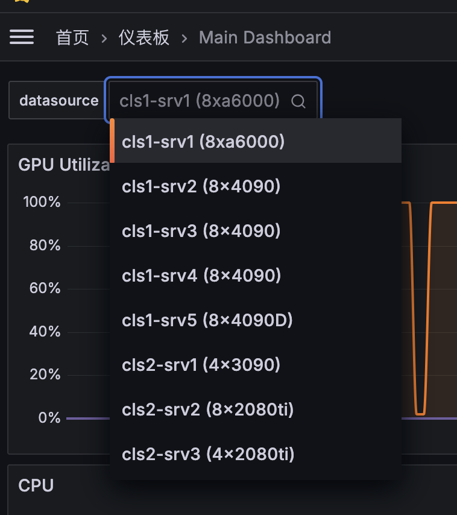

# 使用文档

## 监控

<https://grafana.lab.tiankaima.cn:8443/>

配置了 Prometheus + Grafana 来做监控：

- CPU、内存、硬盘、网络流量：`node-exporter`
- GPU 监控：`dcgm-exporter`
- 监控本体：`prometheus`
- 可视化：`grafana`

配置文件参考：<https://gist.github.com/tiankaima/9c31f36435af0c5093704b366d43eea2>

!!! note ""

    + 为 Grafana 开启了「允许未登录」的设置，可以直接访问查看监控数据，只能查看不能修改。
    + 同机房的另一台机器 `8xa6000` 使用了类似的部署方案，但使用这台机器的 grafana 做可视化，在下面的设置中可以切换数据源。

        {width=400}

## 网络说明

+ 使用如下命令设置代理：

    ```bash
    export http_proxy="http://192.168.50.1:7890";
    export https_proxy=$http_proxy;
    export no_proxy="localhost, 127.0.0.1, ::1"
    ```