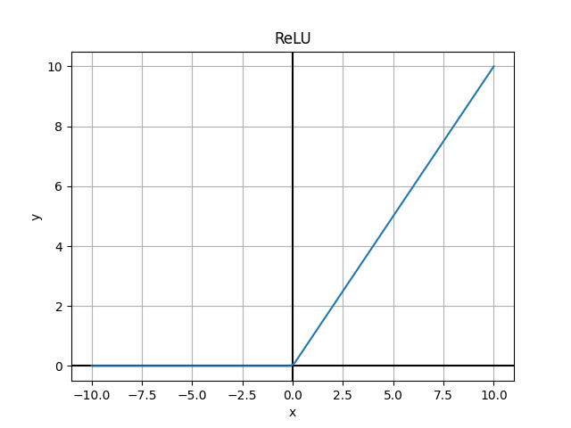

# Neural Network 神经网络

## 概念 {#concepts}

-   层结构 _Layer_：神经网络的基本组成单元，包括输入层、隐藏层、输出层
-   神经元 _Neuron_：神经网络的基本单元，接收输入，输出结果
-   权重 _Weight_：神经元接收到的输入的权重
-   偏置 _Bias_：神经元的偏置项
-   激活函数 _Activation Function_：神经元的非线性变换函数，使得神经网络可以拟合非线性函数
-   前向传播 _Forward Propagation_：输入数据经过神经网络，得到输出，预测结果
-   反向传播 _Backward Propagation_：通过梯度下降算法，更新权重，使得损失函数最小化
-   损失函数 _Loss Function_：衡量预测值与真实值之间的差异
-   优化器 _Optimizer_：梯度下降算法的变种，用于更新权重
-   正则化 _Regularization_：防止过拟合
-   批量 _Batch_：每次迭代的样本数
-   学习率 _Learning Rate_：梯度下降算法的步长
-   过拟合 _Overfitting_：模型在训练集上表现很好，但在测试集上表现很差
-   欠拟合 _Underfitting_：模型无法在训练集上表现很好
-   Dropout：随机关闭一些神经元，防止过拟合
-   Batch Normalization：对每个 batch 进行标准化，加速训练

## 激活函数 _Activation Function_

-   Sigmoid (1)
    { .annotate }

    1.  

    $$
    f(x) = \frac{1}{1 + e^{-x}}
    $$

    -   输出范围：$(0, 1)$
    -   用于二分类问题的输出层
    -   当 $\lvert x \rvert$ 较大时，梯度接近于 $0$，导致梯度消失[^vanishing-gradient]

        [^vanishing-gradient]: [Vanishing Gradient Problem](https://en.wikipedia.org/wiki/Vanishing_gradient_problem)

-   Tanh (1)
    { .annotate }

    1.  

    $$
    f(x) = \frac{e^x - e^{-x}}{e^x + e^{-x}}
    $$

    -   输出范围：$(-1, 1)$
    -   **作为 Sigmoid 的替代，效果更好 [^tanh-better-than-sigmoid]**

        -   $E[f(x)] = 0$, 收敛速度更快 (存疑)
        -   多数情况下给出的梯度更大，收敛速度更快

        [^tanh-better-than-sigmoid]: [Why is tanh always better than sigmoid function in neural networks?](https://stats.stackexchange.com/questions/330559/why-is-tanh-always-better-than-sigmoid-function-in-neural-networks)

-   ReLU (1)
    { .annotate }

    1.  

    $$
    f(x) = \max(0, x)
    $$

    -   Rectified Linear Unit
    -   输出范围：$[0, +\infty)$
    -   计算简单
    -   死亡 ReLU 问题：当输入值为负时，梯度为 $0$，导致权重无法更新，一些神经元永远不会被激活 [^dying-relu]

        [^dying-relu]: [What is the "dying ReLU" problem in neural networks?](https://datascience.stackexchange.com/questions/5706/what-is-the-dying-relu-problem-in-neural-networks)

-   Leaky ReLU (1)
    { .annotate }

    1.  

    $$
    f(x) = \max(\alpha x, x)
    $$

    -   输出范围：$(-\infty, +\infty)$
    -   修正了 ReLU 的死亡问题 [^dying-relu]

-   Softmax

    $$
    \mathbf{f}_i(\mathbf{x}) = \frac{e^{x_i}}{\sum_{j=1}^{n} e^{x_j}}
    $$

    -   用于多分类问题的输出层 [^softmax]

        [^softmax]: [Softmax vs Sigmoid function in logistic classifier](https://stats.stackexchange.com/questions/233658/softmax-vs-sigmoid-function-in-logistic-classifier)

    -   输出范围：\((0, 1)\)
    -   所有输出的和为 $1$

    ???+ comment "关于 Softmax"

        与其说 Softmax 是激活函数，不如说是一种归一化方法，将输出转换为概率分布。

        !!! note ""

            上面的激活函数都是 $\mathbb{R}^n \to \mathbb{R}$ 的映射，而 Softmax 是 $\mathbb{R}^n \to \mathbb{R}^n$ 的映射。

        选用 $e^{x_i}$ 的原因有几个：

        -  输出范围为正数，而且是单调递增的
        -  [例如这里的 Overflow 问题](https://stats.stackexchange.com/questions/304758/softmax-overflow) 可以通过减去最大 (小) 值解决，这是由于：

            $$
            \frac{e^{x_i - c}}{\sum_{j=1}^{n} e^{x_j - c}} = \frac{e^{x_i}}{\sum_{j=1}^{n} e^{x_j}}
            $$
        - 梯度计算： $(i\neq j)$

            $$
            \begin{aligned}
            &\nabla_{x_i} \mathbf{f}_i(x) = \mathbf{f}_i(x)(1 - \mathbf{f}_i(x)) \\
            &\nabla_{x_j} \mathbf{f}_i(x) = -\mathbf{f}_i(x) \mathbf{f}_j(x)
            \end{aligned}
            $$

            也就是：$\nabla_{x_j} \mathbf{f}_i(\mathbf{x}) = \mathbf{f}_i(\mathbf{x})(\delta_{ij} - \mathbf{f}_j(\mathbf{x}))$

## 前向传播 _Forward Propagation_

???+ note "神经元的输出"

    $$
    y=f\left(\sum\limits_{i=1}^{n} w_i x_i + b\right)
    $$

    其中：

    -   $y$：神经元的输出
    -   $f$：激活函数
    -   $w_i$：权重
    -   $x_i$：输入
    -   $b$：偏置

## 损失函数 _Loss Function_

!!! note

    下面的 $y$ 为真实值，$\hat{y}$ 为预测值(计算得到的值)

-   均方误差 _Mean Squared Error_

    $$
    L(y, \hat{y}) = \frac{1}{n} \sum_{i=1}^{n} (y_i - \hat{y}_i)^2
    $$

    -   用于回归问题

-   交叉熵 _Cross Entropy_

    $$
    L(y, \hat{y}) = -\sum_{i=1}^{n} y_i \log(\hat{y}_i)
    $$

    -   用于分类问题

    ??? note "交叉熵的定义"

        一般而言，衡量两个分布 $p,q$ 之间的交叉熵按如下定义：

        $$
        H(p,q) = -E_p[\log q]
        $$

        写成 R-S notation:

        $$
        H(p,q) = - \int_\mathcal{X} \log q(x) dP(x) = - \int_\mathcal{X} p(x) \log q(x) dx
        $$

        对应的离散形式也就是上面的公式。

    ???+ note "独热编码"

        注意到真实分布 $y$ 一般都是独热编码 _One-Hot Encoding_ (1) 的形式，考虑 $n$ 个标签的情况：
        { .annotate }

        1.  独热编码

            $$
            y = [0, 0, \ldots, 1, \ldots, 0]
            $$

        不妨设 $k$ 是真实标签的索引，那么交叉熵可以写成：

        $$
        L(y, \hat{y}) = -\log(\hat{y}_k) \geq 0
        $$

        交叉熵最小的情况，即预测值 $\hat{y}$ 与真实值 $y$ 完全一致时，(1)：
        { .annotate }

        1.  最小交叉熵

            $$
            \hat{y}_k = 1, \quad \hat{y}_i = 0, \forall i \neq k
            $$

        $$
        L(y, \hat{y}) = -\log(1) = 0
        $$

        _tl;dr:_ 使用独热编码时，上面的写法只是 $-log(\hat{y}_k)$ 的另一种写法，也就是只有真实标签的预测值参与计算损失。

## [反向传播 _Backward Propagation_](./bp.md)

-   梯度下降算法 _Gradient Descent_

    $$
    w \leftarrow w - \alpha \frac{\partial L}{\partial w}
    $$

    -   $\alpha$：学习率
    -   $\displaystyle\frac{\partial L}{\partial w}$：损失函数对权重的偏导数
    -   通过链式法则，计算每个参数的梯度，更新参数

-   随机梯度下降 _Stochastic Gradient Descent_

    -   每次迭代只使用一个样本更新参数
    -   速度快，但不稳定

## 正则化 _Regularization_

!!! note ""

    与传统机器学习中惩罚项(正则项)的思路类似, 在损失函数 _Loss Function_ 中额外添加关于参数的惩罚项, 以防止过拟合(1)。
    { .annotate }

    1.  通过将模型的参数变得较小，正则化可以防止模型在训练数据上过度拟合。较小的权重意味着模型对每个特征的依赖度较低，更加平滑和简单，从而增强其在未见数据上的泛化能力。

-   $L_1$ 正则化

    $$
    L(w) = L_0(w) + \lambda \sum_{i=1}^{n} \lvert w_i \rvert
    $$

    -   使得权重稀疏，适用于特征选择

-   $L_2$ 正则化

    $$
    L(w) = L_0(w) + \lambda \sum_{i=1}^{n} w_i^2
    $$

    -   使得权重较小，防止过拟合

## Dropout

-   随机关闭一些神经元，防止过拟合

## Batch Normalization

-   对每个 batch 进行标准化，加速训练
